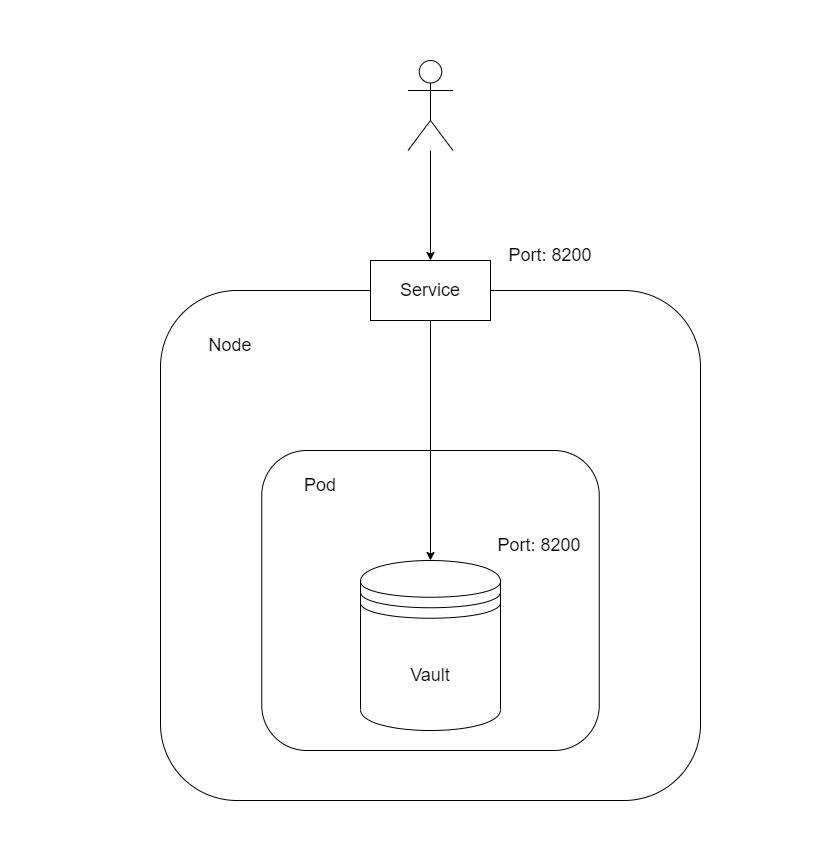

# Лабораторная работа №1 "Установка Docker и Minikube, мой первый манифест."

## Общая информация

University: [ITMO University](https://itmo.ru/ru/)

Faculty: [FICT](https://fict.itmo.ru)

Course: [Introduction to distributed technologies](https://github.com/itmo-ict-faculty/introduction-to-distributed-technologies)

Year: 2022/2023

Group: K4113c

Author: Borisov Svyatoslav Igorevich

Lab: Lab1

Date of create: 27.11.2022

Date of finished: 

## Ход работы

Предварительно был установлен и запущен Docker а также установлен и запущен Minikube согласно инструкции.

### Запуск пода

После запуска кластера и проверки подключения, был создан манифест [vault.yaml](vault.yaml). Для развертывания пода была использована следущая команда: 

```bash
minikube kubectl -- apply -f vault.yaml
```
Убедились, что под был успешно запущен.

### Создание сервиса

Создаем сервис для доступа к контейнеру с помощью команды

```bash
minikube kubectl -- expose pod vault --type=NodePort --port=8200
```

### Получение доступа к сервису

Далее, открываем порт для доступа к сервису с помощью команды

```bash
minikube kubectl -- port-forward service/vault 8200:8200
```

С помощью неё мы прокинули порт нашего компьютера в контейнер Vault. После выполнения данной команды, приложение становится доступным по адресу http://localhost:8200 :


### Получение токена доступа Vault

Получим логи контейнера с помощью команды и отфильтруем их с помощью утилиты findstr: 

```bash
minikube kubectl -- logs vault | findstr "Token"
```

Вывод консоли:

```bash
Root Token: hvs.9M8HY1vLmJryxIg58oMJb67J
```

Авторизуемся с помощью полученного токена и проходим на страницу успеншой авторизации:


### Диаграмма организации контейнеров




