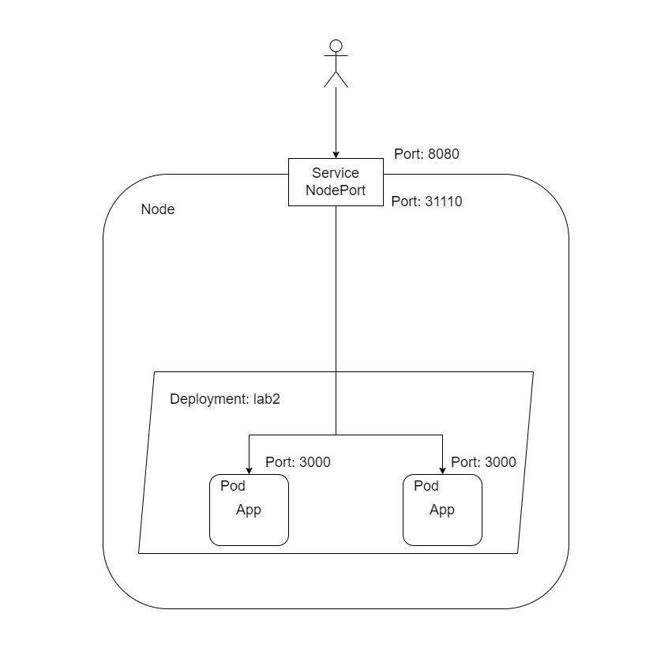

# Лабораторная работа №2 "Развертывание веб сервиса в Minikube, доступ к веб интерфейсу сервиса. Мониторинг сервиса."

## Общая информация

University: [ITMO University](https://itmo.ru/ru/)

Faculty: [FICT](https://fict.itmo.ru)

Course: [Introduction to distributed technologies](https://github.com/itmo-ict-faculty/introduction-to-distributed-technologies)

Year: 2022/2023

Group: K4113c

Author: Borisov Svyatoslav Igorevich

Lab: Lab2

Date of create: 27.11.2022

Date of finished: 

## Ход работы

### Создание Deployment

Для развертывания приложения был создан манифест [deployment.yaml](deployment.yaml). Deployment — это объект Kubernetes, представляющий работающее приложение в кластере. Оно позволяет управлять приложением, его версиями и обновлениями. В объекте Deployment хранится информация о конфигурации подов, количестве необходимых реплик и методе обновления подов в случае изменения их конфигурации.

При развертывании deployment создается еще одна абстракция - ReplicaSet. Она отвечает за описание и контроль за несколькими экземплярами приложений.

Для развертывания deployment используем следующую команду:

```bash
minikube kubectl -- apply -f deployment.yaml
```
### Создание сервиса типа NodePort 

Для предоставления доступа к подам деплоймента `lab2` был создан манифест [service.yaml](service.yaml) для создания сервиса типа NodePort.

Сервисы в Kubernetes позволяют определить набор подов и правила доступа к ним. С помощью сервисов разные части приложения могут "общаться" друг с другом (например, фронтенд с бэкендом).

Для создания описанного в манифесте сервиса была использована следующая команда:

```bash
minikube kubectl -- apply -f service.yaml
```

### Проброс портов и результаты работы

С помощью комманды

```bash
minikube kubectl -- port-forward service/lab2 8888:8080
```
Открываем порт для доступа к сервису и заходим через браузер в приложение:


Имя и IP контейнера не меняются т.к. в качестве сервиса был выбран NodePort.

Развернутый deployemnt:


Развернутые поды:


Развернутый сервис:


### Логи контейнеров

Плдучаем логи контейнеров с помощью команды:

```bash
minikube kubectl -- logs <pod_name>
```

Логи подов:


### Схема организации контейнеров и сервисов


